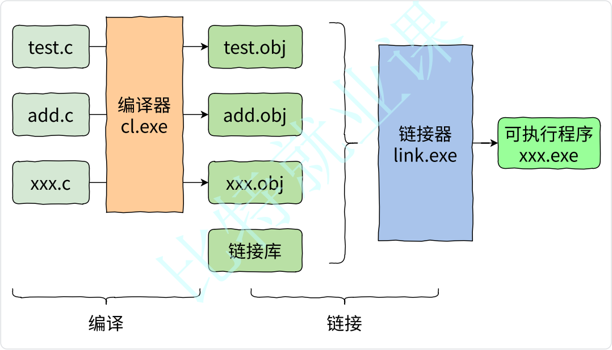

# 第1讲：C语言常见概念

**目录：**

[TOC]

---

## 一、C语言是什么？

> 类比：人和人交流：自然语言（汉语、英语、日语）。

人和计算机交流，使用**计算机语言**。

C语言就是众多计算机语言中的一种。

例如，C语言、C++、Java、Go、Python都是计算机语言。

---

## 二、C语言的历史和辉煌

C语言最初是作为 Unix 系统的开发工具而发明的。


---

## 三、编译器的选择 - VS2022

> 计算机不是万能的，计算机能够识别的是二进制的指令。

C语言是一门编译型计算机语言，必须通过编译器翻译和链接器的链接，生成二进制的可执行文件，可执行文件才能执行。



> 注意：
> 1. 每个源文件（`.c`）单独经过编译器处理生成对应的目标文件（`.obj`为后缀的文件）；
> 2. 多个目标文件和库文件经过链接器处理生成对应的可执行文件（`.exe`文件）。

---

## 四、VS项目和源文件、头文件介绍

C语言把.c为后缀的文件称为源文件，把.h为后缀的文件称为头文件。

在VS上写代码的时候，一般我们会把代码放在一个**项目**（**工程**）中进行管理。

---

## 五、第一个C语言程序

> 在VS2022中，编译+链接+运行代码快捷键：`Ctrl + F5`。
> 

``` C
#include <stdio.h>

int main()
{
	printf("hello bit\n");
	return 0;
}
```

---

## 六、main 函数

每个C语言程序不管有多少行代码，都是从 main 函数开始执行的，main 函数是程序的入口，main 函数也被叫做：**主函数**。

main 函数的模板：

``` C
int/* int 表示main函数结束的时候会返回一个整数 */ main()
{

	return 0;   // 返回一个整型类型的值，正好前后呼应
}
```

总结如下：
1. main 函数是程序的入口；
2. main 函数有且仅有一个；
3. 即使一个项目中有多个.c文件，但是只能有一个 main 函数（因为程序的入口只能有一个）。

其实main函数可以有参数，它的参数是有特殊意义的，如果想使用main函数的参数，那就写上；如果不想使用main函数的参数，那就不写。如下所示：

``` C
int main(int argc, char* argv[])
{
    return 0;
}
```

## 七、printf 和库函数

printf（print format - 按照格式来打印信息） 是一个库函数（C语言的标准库中提供的现成的函数），它的功能是在标准输出设备（一般指屏幕）上进行信息的打印。

为了不再重复实现常见的代码，让程序员提升开发效率，C语言标准规定了一组函数，这些函数再由不同的编译器厂商根据标准进行实现，提供给程序员使用。这些函数组成了一个函数库，被称为**标准库**，这些函数也被称为**库函数**。

我们在使用库函数的时候，是需要包含头文件的，比如，printf 函数需要包含的就是 stdio.h 这个头文件。

> 库函数可参考链接：https://cplusplus.com/reference/fstream/。

示例代码：

``` C
#include <stdio.h>
/*
 * std - standard - 标准
 * i - input - 输入
 * o - output - 输出
 */

int main()
{
	printf("hello bit\n");
	printf("hit\n");
	printf("haha\n");

	printf("%d\n", 100);
	printf("%c\n", 'q');
	printf("%f\n", 3.14);
	return 0;
}
```

这里的`%d`，`%c`等是占位符，会被后边的值替换。

> 知识点小结：
> * `""`括起来的一串字符被称为：**字符串**；
> * `''`括起来的叫字符；
> * `\n` - 换行；
> * `%d` - 打印整数；
> * `%c` - 打印字符；
> * `%f` - 打印小数（默认小数点后会打印6位0）；
> * `%s` - 打印字符串。

## 八、关键字介绍

C语言中有一批保留的名字的符号，比如：`int`、`if`、`return`，这些符号被称为保留字或者关键字。
* 关键字都有特殊的意义，是保留给C语言使用的；
* 程序员自己在创建标识符的时候是不能和关键字重复的；
* 关键字也是不能自己创建的。

## 九、字符和ASCII编码

C语言中字符是用单引号括起来的，如：`'a'`，`'b'`，`'@'`。

C语言中的字符遵循ASCII编码的方式：


我们最好能掌握几组特殊的数据：
* 字符 A~Z 的ASCII码值从 65~90；
* 字符 a~z 的ASCII码值从 97~122；
* 对应的大小写字符（a和A）的ASCII码值的差值是 32；
* 数字字符 0~9 的ASCII码值从 48~57；
* 换行 \n 的ASCII码值是 10；
* 在这些字符中ASCII码值从 0~31 这32个字符是不可打印字符，无法打印在屏幕上观察。

示例代码：

``` C
#include <stdio.h>

int main()
{
	printf("%c\n", 'a');	// a
	printf("%c\n", 97);		// a

	/* 产生从 32~127 码值的ASCII码 */
	int i = 0;
	for (i = 32; i <= 127; i++)
	{
		printf("%c ", i);
		if (i % 16 == 15)
		{
			// 每打印 16 个字符换行
			printf("\n");
		}
	}

	return 0;
}
```

## 十、字符串和 \0

C语言中如何表示字符串呢？

使用双引号括起来的一串字符就被称为字符串，如："abcdef"，就是一个字符串。

C语言字符串中一个特殊的知识，就是在字符串的末尾隐藏放着一个 \0 字符，这个 \0 字符是字符串的结束标志。所以我们在使用库函数 printf() 打印字符或者 strlen() 计算字符串长度的时候，遇到 \0 的时候就自动停止了。

字符串可以存放在字符数组中：
``` C
char arr1[] = "abcdef";  // arr1中含有 \0
```

但是，如果将字符逐个存放到字符串数组中：
``` C
char arr2[] = { 'a', 'b', 'c', 'd', 'e', 'f' }; // arr2中没有 \0
```

示例代码：

``` C
#include <stdio.h>
#include <string.h>
int main()
{
	char arr1[] = "abcdef";
	char arr2[] = { 'a', 'b', 'c', 'd', 'e', 'f' };

	printf("%d\n", strlen(arr1));	// 6
	printf("%d\n", strlen(arr2));	// ?

	return 0;
}
```

> strlen 是一个函数，用于求字符串的长度，统计的是字符串中\0之前的字符个数，在使用时需要包含头文件 string.h。
> strlen 返回的值是 size_t 类型的，应该使用 %zd。

## 十一、转义字符

在字符中有一组特殊的字符是转移字符，转义字符顾名思义：转变原来的意思的字符。

C语言中的转义字符具体如下：
* `\?`：在书写连续多个问号时使用，防止它们被解析成三字母词（例如，`??) --> ]`，`??( --> [`），在新的编译器上没法验证了；
* `\'`：用于表示字符常量`'`；
* `\"`：用于表示一个字符串内部的双引号；
* `\\`：用于表示一个反斜杠，防止它被解释为一个转义序列符；
* `\a`：警报，这会使得终端发出警报声或出现闪烁，或者两者同时发生；
* `\b`：退格键，光标回退一个字符，但不删除字符（若在其后继续打印字符，则会把被退格的字符覆盖掉）；
* `\f`：换页符，光标移到下一页。在现代系统上，这已经反映不出来了，行为改为类似于 \v；
* `\n`：换行符；
* `\r`：回车符，光标移到同一行的开头；
* `\t`：制表符，光标移到下一个水平制表位，通常是下一个4/8的倍数；
* `\v`：垂直分隔符，光标移到下一个垂直制表位，通常是下一行的同一列。

下面2种转义字符可以理解为字符的8进制或者16进制表示形式：
* `\ddd`：d d d 表示 1~3 个八进制的数字；
* `\xdd`：d d 表示 2 个十六进制数字。

> \0：null字符，代表没有内容，\0就是\ddd这类转义字符的一种，用于字符串的结束标志，其ASCII码值是0。

示例代码：

``` C
#include <stdio.h>
#include <string.h>
int main()
{
	printf("%c\n", '\130');	// 将 \ 后的8进制数字转换成10进制的数字，这个数字作为ASCII码值表示的字符就是 'X'
	printf("%c\n", '\77');	// 将 \ 后的8进制数字转换成10进制的数字，这个数字作为ASCII码值表示的字符就是 '?'
	printf("%c\n", '\x36');	// 将 \ 后的16进制数字转换成10进制的数字，这个数字作为ASCII码值表示的字符就是 '6'

	printf("%zd\n", strlen("abcdef"));//6
	printf("%zd\n", strlen("c:\test\bit\114\test.c"));//16
	printf("%zd\n", strlen("c:\test\bit\118\test.c"));//17

	return 0;
}
```