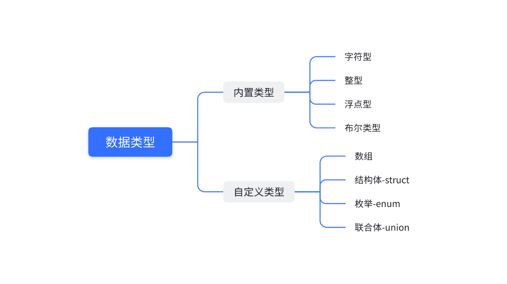
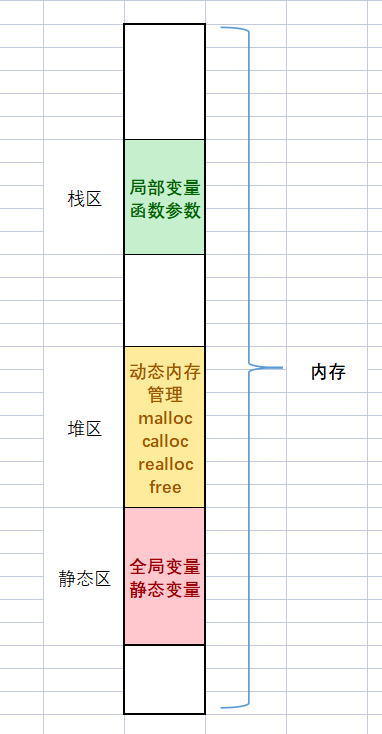

# 第2讲：C语言数据类型和变量

## 一、数据类型介绍

C语言提供了丰富的**数据类型**来描述生活中的各种数据。

使用**整型类型**来描述整数，使用**字符类型**来描述字符，使用**浮点型类型**来描述小数。

所谓类型，就是相似的数据拥有的共同特征，编译器只有知道了数据的类型，才知道怎么操作数据。



> 内置类型：C语言本身就具有的；
> 自定义类型：自己创造的。

### 1.1 字符型

``` C
char    // character
[signed] char   // 有符号的
unsigned char   // 无符号的
```

### 1.2 整型

整型分为以下几种形式：
* short [int] - 短整型；
* int - 整型；
* long [int] - 长整型；
* long long [int] - 更长的整型。

### 1.3 浮点型

> 小数也叫浮点数。

浮点数分为以下几种形式：
* float - 单精度浮点型；
* double - 双精度浮点型；
* long double

### 1.4 布尔类型

> C语言中规定：
> * 0 表示假；
> * 非 0 是真。

在 C99 中也引入了布尔类型，是专门表示真假的：
``` C
_Bool
```

布尔类型的使用得包含头文件`<stdbool.h>`。

布尔类型变量的取值是：`true`或`false`。

为了便于使用，作规定如下：
``` C
#define bool _Bool

#define false 0
#define true 1
```

### 1.5 各种数据类型的长度

#### 1.5.1 `sizeof`操作符

`sizeof`是一个关键字，也是操作符，专门是用来计算sizeof的操作符数的类型长度的，单位是**字节**。

> 字节：计算机中的单位。
> 计算机中的单位如下：
> * bit - 比特位；
> * Byte - 字节（1Byte = 8bit）；
> * KB（1KB = 1024Byte）；
> * MB(1MB = 1024KB)；
> * GB（1GB = 1024MB）；
> * TB（1TB = 1024GB）；
> * PB（1PB = 1024TP）。
>
> 1 个 2 进制位的存储需要一个bit位的空间。

`sizeof`操作符的操作数可以是类型，也可是变量或者表达式。

`sizeof`的计算结果是`size_t`类型的。

> 类型`unsigned int`、`unsigned long`、`unsigned long long`，对应的 printf() 占位符分别是`%u`、`%lu`、`%llu`。

使用方法如下所示：
``` C
sizeof(类型)
sizeof 表达式   // 如果作用对象为类型，则不能省略掉括号
```

> C语言标准规定：`sizeof(long) >= sizeof(int)`。

#### 1.5.2 数据类型长度

``` C
#include <stdio.h>
#include <stdbool.h>

int main()
{
	printf("%zd\n", sizeof(char));	// 1
	printf("%zd\n", sizeof(short));	// 2
	printf("%zd\n", sizeof(int));	//4
	printf("%zd\n", sizeof(long));	//4
	printf("%zd\n", sizeof(long long));	// 8
	printf("%zd\n", sizeof(float));	// 4
	printf("%zd\n", sizeof(double));	// 8
	printf("%zd\n", sizeof(long double));	// 8
	printf("%zd\n", sizeof(_Bool));	// 1

	int a = 10;
	printf("%zd\n", sizeof(int));	// 4
	printf("%zd\n", sizeof(a));	// 4
	printf("%zd\n", sizeof a);	// 4

	return 0;
}
```

#### 1.5.3 `sizeof`中表达式不计算

`sizeof`中如果放的是表达式，表达式不会真实计算！

``` C
// 测试：sizeof 中表达式不计算

#include <stdio.h>
#include <stdbool.h>

int main()
{
	short s = 2;
	int b = 10;

	printf("%zd\n", sizeof(s = b + 1));

	printf("s = %d\n", s);

	return 0;
}
```

## 二、signed 和 unsigned

C语言使用`signed`和`unsigned`关键字修饰**字符型和整型**类型的：
* `signed`关键字，表示一个类型带有正负号，包含负值；
* `unsigned`关键字，表示该类型不带有正负号，只能表示零和正整数。

对于`int`类型，默认是带有正负号的，也就是说`int`等同于`signed int`。

对于`char`类型，是有符号（`signed char`）还是无符号（`signed char`）不确定，是取决于编译的实现。大部分的编译器上`char == signed char`。

> 对于有符号的整数打印应该使用`%d`；
> 对于无符号整数的打印应该使用`%u`。

整数变量声明为`unsigned`的好处是，同样长度的内存能够表示的最大整数值，增大了一倍。
* 16 位的`signed short int`的取值范围是：-32768 ~ 32767，最大值是32767；
* 而`unsigned short int`的取值范围是：0 ~ 65535，最大值增大到了65535。

32 位的`signed int`的取值范围可以参看 limits.h 中给出的定义。

## 三、数据类型的取值范围

如果要查看当前系统上不同数据类型的极限值：
* limits.h 文件说明了整型类型的取值范围；
* float.h 这个头文件中说明了浮点型类型的取值范围。

为了代码的可移植性，需要知道某种整数类型的极限值时，应该尽量使用这些常量：
* `SCHAR_MIN`，`SCHAR_MAX`：signed char 的最小值和最大值；
* `SHRT_MIN`，`SHRT_MAX`：short 的最小值和最大值；
* `INT_MIN`，`INT_MAX`：int 的最小值和最大值；
* `LONG_MIN`，`LONG_MAX`：long 的最小值和最大值；
* `LLONG_MIN`，`LLONG_MAX`：long long 的最小值和最大值；
* `UCHAR_MAX`：unsigned char 的最大值；
* `USHRT_MAX`：unsigned short 的最大值；
* `UINT_MAX`：unsigned int的最大值；
* `ULONG_MAX`：unsigned long 的最大值；
* `ULLONG_MAX`：unsigned long long 的最大值。

## 四、变量

### 4.1 变量的创建

类型是用来**创建变量**的。

C语言中把经常变化的值称为**变量**，不变的值称为**常量**。

变量创建的语法形式是这样的：
``` C
data_type name;
   |        |
   |        |
数据类型   变量名
```

例如：
``` C
int age;    // 整型变量
char ch;    // 字符变量
double weight;  // 浮点型变量
```

变量在创建的时候就给一个初始值，就叫初始化：
``` C
int age = 18;
age = 20;   // 赋值
char ch = 'w';
float score = 3.14f;
double weight = 48.0;
unsigned int height = 100;
```

### 变量的分类

变量分为两类：
* 全局变量：在大括号外部定义的变量就是全局变量；
  * 全局变量的使用范围更广，整个工程中想使用，都是有办法使用的。
* 局部变量：在大括号内部定义的变量就是局部变量；
  * 局部变量的使用范围是比较局限，只能在自己所在的局部范围内使用的。

当局部变量和全局变量同名的时候，局部变量优先使用：
``` C
#include <stdio.h>
#include <stdbool.h>

int m = 1000;

int main()
{
	int m = 100;

	printf("%d\n", m);	// 100

	return 0;
}
```

> 全局变量和局部变量在内存中存储在哪里呢？
>
> 一般我们在学习C/C++语言的时候，我们会关注内存中的三个区域：**栈区**、**堆区**、**静态区**。
> 1. 局部变量是放在内存的**栈区**；
> 2. 全局变量是放在内存的**静态区**；
> 3. 堆区是用来**动态内存管理**的。
> 
> 
> 
> 其实内存区域的划分会更加细致，以后在操作系统的相关知识的时候会介绍。

## 五、算术操作符：+、-、*、/、%

C语言中为了方便运算，提供了一系列操作符，其中有一组操作符叫：**算术操作符**。分别是：`+`、`-`、`*`、`/`、`%`，这些操作符都是**双目操作符**。

> 注意：
> 操作符也被叫做：**运算符**，是不同的翻译，意思是一样的。

### 5.1 `+`和`-`

`+`和`-`用来完成加法和减法。
`+`和`-`都是有 2 个操作数的，位于操作符两端的就是它们的操作数，这种操作符也叫**双目操作符**。

### 5.2 `*`

运算符`*`用来完成乘法。

### 5.3 `/`

运算符`/`用来完成除法。

除号的两端如果是整数，执行的是整数除法，得到的结果也是整数。

C语言里面的整数除法是整除，只会返回整数部分，丢弃小数部分。

如果希望得到浮点数的结果，**两个运算数必须至少有一个浮点数**，这时C语言就会进行浮点数除法。

### 5.4 `%`

运算符%表示求模（余）运算，即返回两个整数相除的余值。这个运算符只能用于整数，不能用于浮点数。

负数求模的规则是，结果的正负号由第一个运算数的正负号决定。

## 六、赋值操作符：`=`和复合赋值

在变量创建的时候给一个初始值叫**初始化**，在变量创建好后，再给一个值，这叫赋值：
``` C

```

赋值操作符=是一个随时可以给变量赋值的操作符。

### 6.1 连续赋值

赋值操作符也可以连续赋值，如：
``` C
int a = 3;
int b = 5;
int c = 0;
c = b = a + 3;  // 连续赋值，从右向左依次赋值的
```

上述代码等价于以下形式：
``` C
int a = 3;
int b = 5;
int c = 0;
b = a + 3;
c = b;
```

### 6.2 复合赋值符

C语言提供了复合赋值符，方便我们编写代码，这些赋值符有：
* `+=`、`-=`；
* `*=`、`/=`、`%=`；
* `>>=`、`<<=`；
* `&=`、`|=`、`^=`。

## 七、单目操作符：`++`、`--`、`+`、`-`

C语言中还有一些操作符只有一个操作数，被称为单目操作符。`++`、`--`、`+`（正）、`-`（负）就是单目操作符的。

### 7.1 `++`和`--`

`++`是一种自增的运算符，又分为前置`++`和后置`++`；`--`是一种自减的操作符，也分为前置`--`和后置`--`。

#### 7.1.1 前置`++`

示例代码：
``` C
int a = 10;
int b = ++a;    // ++的操作数是a，是放在a的前面的，就是前置++
printf("a = %d b = %d\n", a, b);

/* 相当于以下代码： */

int a = 10;
a = a + 1;
int b = a;
printf("a = %d b = %d\n", a, b);
```

**计算口诀**：先 +1，后使用。

#### 7.1.2 后置`++`

示例代码：
``` C
int a = 10;
int b = a++;    // ++的操作数是a，是放在a的后面的，就是后置++
printf("a = %d b = %d\n", a, b);

/* 相当于以下代码： */

int a = 10;
int b = a;
a = a + 1;
printf("a = %d b = %d\n", a, b);
```

**计算口诀**：先使用，后 +1。

#### 7.1.3 前置`--`

**计算口诀**：先 -1，后使用。

#### 7.1.4 后置`--`

**计算口诀**：先使用，后 -1。

### 7.2 `+`和`-`

这里的`+`是正号，`-`是负号，都是单目操作符。

运算符`+`对正负值没有影响，是一个完全可以省略的运算符，但是写了也不会报错：
``` C
int a = +10;    // 等价于 int a = 10;
```

示例代码：
``` C
#include <stdio.h>
#include <stdbool.h>

int m = 1000;

int main()
{
	int a = -10;
	printf("%d\n", +10);	// 10
	printf("%d\n", +a);		// -10
	printf("%d\n", 10);		// 10

	return 0;
}
```

运算符`-`用来改变一个值的正负号，负数的前面加上`-`就会得到正数，正数的前面加上`-`会得到负数：
``` C
int a = 10;
int b = -a;
int c = -10;
printf("b = %d c = %d\n", b, c);    // 这里的 b 和 c 都是-10

int a = -10;
int b = -a;
printf("b = %d\n", b);  // 这里的b是10
```

示例代码：
``` C
#include <stdio.h>
#include <stdbool.h>

int m = 1000;

int main()
{
	int a = -10;
	printf("%d\n", -10);	// -10
	printf("%d\n", -a);		// 10
	printf("%d\n", 10);		// 10

	return 0;
}
```

## 八、强制类型转换

在操作符中还有一种特殊的操作符是强制类型转换，语法形式很简单，形式如下：
``` C
(类型)
```

使用示例：
``` C
int a = (int)3.14;  // 意思是将 3.14 强制类型转换为 int 类型，这种强制类型转换只取整数部分
```

俗话说，强扭的瓜不甜，我们使用强制类型转换都是万不得已的时候使用，如果不需要强制类型转化就能实现代码，这样自然更好的。

要注意，并不是任何情况都能使用强制类型转换。例如，无法实现将一个自定义结构体类型数据强制类型转换为 int 整型。