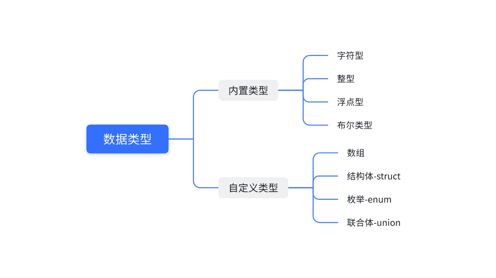
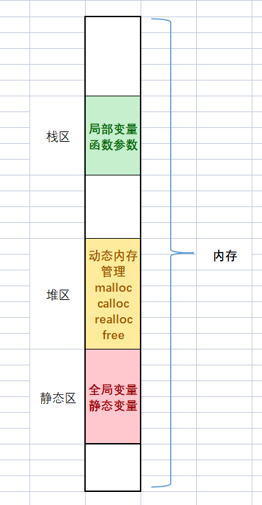
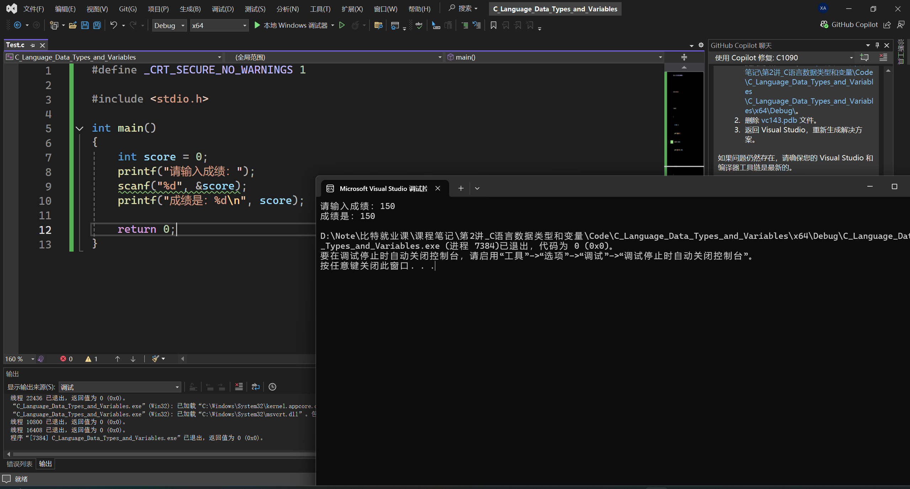
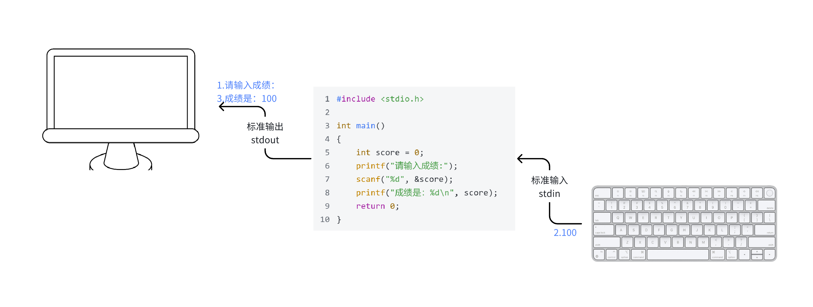
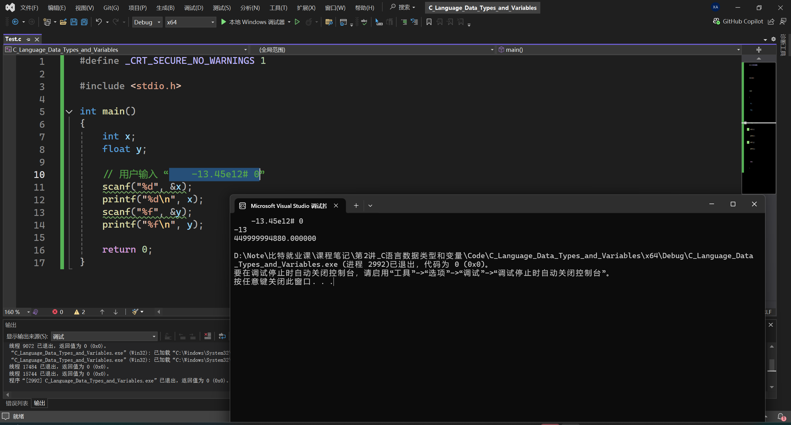
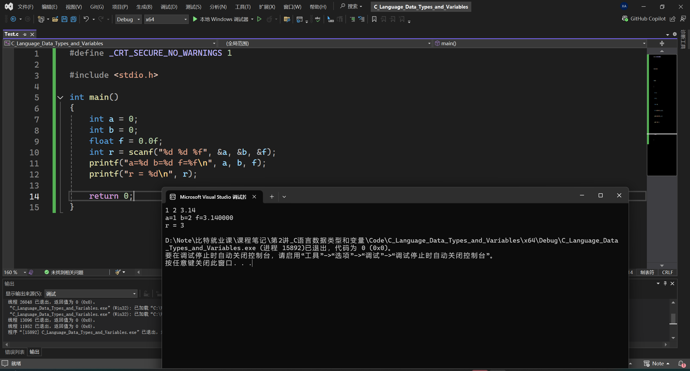
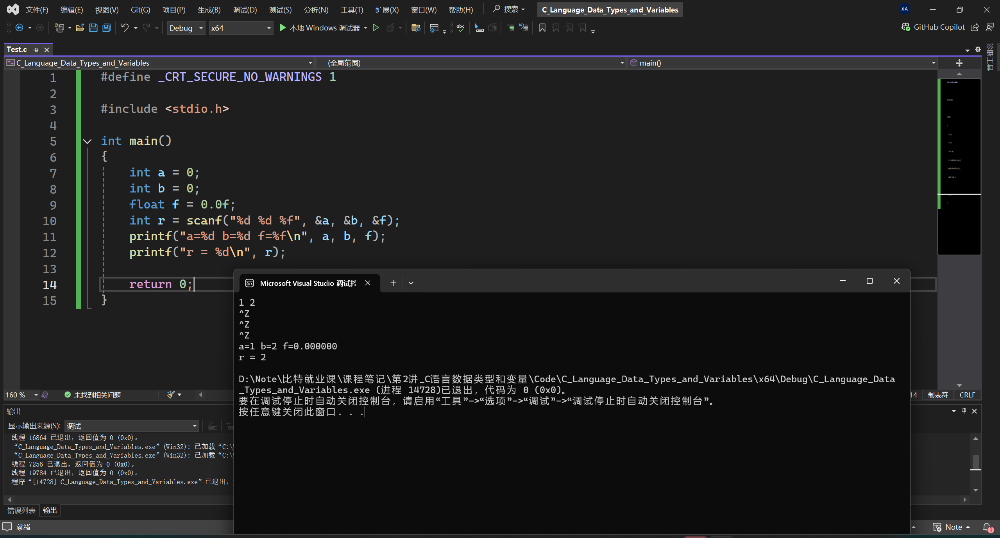
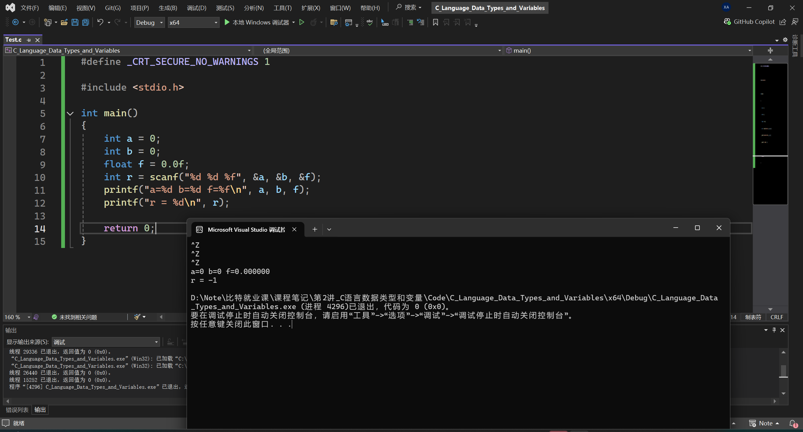

# 第2讲：C语言数据类型和变量

**目录：**

[TOC]

---

## 一、数据类型介绍

C语言提供了丰富的**数据类型**来描述生活中的各种数据。

使用**整型类型**来描述整数，使用**字符类型**来描述字符，使用**浮点型类型**来描述小数。

所谓类型，就是相似的数据拥有的共同特征，编译器只有知道了数据的类型，才知道怎么操作数据。



> 内置类型：C语言本身就具有的；
> 自定义类型：自己创造的。

### 1.1 字符型

``` C
char    // character
[signed] char   // 有符号的
unsigned char   // 无符号的
```

### 1.2 整型

整型分为以下几种形式：
* short [int] - 短整型；
* int - 整型；
* long [int] - 长整型；
* long long [int] - 更长的整型。

### 1.3 浮点型

> 小数也叫浮点数。

浮点数分为以下几种形式：
* float - 单精度浮点型；
* double - 双精度浮点型；
* long double

### 1.4 布尔类型

> C语言中规定：
> * 0 表示假；
> * 非 0 是真。

在 C99 中也引入了布尔类型，是专门表示真假的：
``` C
_Bool
```

布尔类型的使用得包含头文件`<stdbool.h>`。

布尔类型变量的取值是：`true`或`false`。

为了便于使用，作规定如下：
``` C
#define bool _Bool

#define false 0
#define true 1
```

### 1.5 各种数据类型的长度

#### 1.5.1 `sizeof`操作符

`sizeof`是一个关键字，也是操作符，专门是用来计算sizeof的操作符数的类型长度的，单位是**字节**。

> 字节：计算机中的单位。
> 计算机中的单位如下：
> * bit - 比特位；
> * Byte - 字节（1Byte = 8bit）；
> * KB（1KB = 1024Byte）；
> * MB(1MB = 1024KB)；
> * GB（1GB = 1024MB）；
> * TB（1TB = 1024GB）；
> * PB（1PB = 1024TP）。
>
> 1 个 2 进制位的存储需要一个bit位的空间。

`sizeof`操作符的操作数可以是类型，也可是变量或者表达式。

`sizeof`的计算结果是`size_t`类型的。

> 类型`unsigned int`、`unsigned long`、`unsigned long long`，对应的 printf() 占位符分别是`%u`、`%lu`、`%llu`。

使用方法如下所示：
``` C
sizeof(类型)
sizeof 表达式   // 如果作用对象为类型，则不能省略掉括号
```

> C语言标准规定：`sizeof(long) >= sizeof(int)`。

#### 1.5.2 数据类型长度

``` C
#include <stdio.h>
#include <stdbool.h>

int main()
{
	printf("%zd\n", sizeof(char));	// 1
	printf("%zd\n", sizeof(short));	// 2
	printf("%zd\n", sizeof(int));	//4
	printf("%zd\n", sizeof(long));	//4
	printf("%zd\n", sizeof(long long));	// 8
	printf("%zd\n", sizeof(float));	// 4
	printf("%zd\n", sizeof(double));	// 8
	printf("%zd\n", sizeof(long double));	// 8
	printf("%zd\n", sizeof(_Bool));	// 1

	int a = 10;
	printf("%zd\n", sizeof(int));	// 4
	printf("%zd\n", sizeof(a));	// 4
	printf("%zd\n", sizeof a);	// 4

	return 0;
}
```

#### 1.5.3 `sizeof`中表达式不计算

`sizeof`中如果放的是表达式，表达式不会真实计算！

``` C
// 测试：sizeof 中表达式不计算

#include <stdio.h>
#include <stdbool.h>

int main()
{
	short s = 2;
	int b = 10;

	printf("%zd\n", sizeof(s = b + 1));

	printf("s = %d\n", s);

	return 0;
}
```

---

## 二、signed 和 unsigned

C语言使用`signed`和`unsigned`关键字修饰**字符型和整型**类型的：
* `signed`关键字，表示一个类型带有正负号，包含负值；
* `unsigned`关键字，表示该类型不带有正负号，只能表示零和正整数。

对于`int`类型，默认是带有正负号的，也就是说`int`等同于`signed int`。

对于`char`类型，是有符号（`signed char`）还是无符号（`signed char`）不确定，是取决于编译的实现。大部分的编译器上`char == signed char`。

> 对于有符号的整数打印应该使用`%d`；
> 对于无符号整数的打印应该使用`%u`。

整数变量声明为`unsigned`的好处是，同样长度的内存能够表示的最大整数值，增大了一倍。
* 16 位的`signed short int`的取值范围是：-32768 ~ 32767，最大值是32767；
* 而`unsigned short int`的取值范围是：0 ~ 65535，最大值增大到了65535。

32 位的`signed int`的取值范围可以参看 limits.h 中给出的定义。

---

## 三、数据类型的取值范围

如果要查看当前系统上不同数据类型的极限值：
* limits.h 文件说明了整型类型的取值范围；
* float.h 这个头文件中说明了浮点型类型的取值范围。

为了代码的可移植性，需要知道某种整数类型的极限值时，应该尽量使用这些常量：
* `SCHAR_MIN`，`SCHAR_MAX`：signed char 的最小值和最大值；
* `SHRT_MIN`，`SHRT_MAX`：short 的最小值和最大值；
* `INT_MIN`，`INT_MAX`：int 的最小值和最大值；
* `LONG_MIN`，`LONG_MAX`：long 的最小值和最大值；
* `LLONG_MIN`，`LLONG_MAX`：long long 的最小值和最大值；
* `UCHAR_MAX`：unsigned char 的最大值；
* `USHRT_MAX`：unsigned short 的最大值；
* `UINT_MAX`：unsigned int的最大值；
* `ULONG_MAX`：unsigned long 的最大值；
* `ULLONG_MAX`：unsigned long long 的最大值。

---

## 四、变量

### 4.1 变量的创建

类型是用来**创建变量**的。

C语言中把经常变化的值称为**变量**，不变的值称为**常量**。

变量创建的语法形式是这样的：
``` C
data_type name;
   |        |
   |        |
数据类型   变量名
```

例如：
``` C
int age;    // 整型变量
char ch;    // 字符变量
double weight;  // 浮点型变量
```

变量在创建的时候就给一个初始值，就叫初始化：
``` C
int age = 18;
age = 20;   // 赋值
char ch = 'w';
float score = 3.14f;
double weight = 48.0;
unsigned int height = 100;
```

### 4.2 变量的分类

变量分为两类：
* 全局变量：在大括号外部定义的变量就是全局变量；
  * 全局变量的使用范围更广，整个工程中想使用，都是有办法使用的。
* 局部变量：在大括号内部定义的变量就是局部变量；
  * 局部变量的使用范围是比较局限，只能在自己所在的局部范围内使用的。

当局部变量和全局变量同名的时候，局部变量优先使用：
``` C
#include <stdio.h>
#include <stdbool.h>

int m = 1000;

int main()
{
	int m = 100;

	printf("%d\n", m);	// 100

	return 0;
}
```

> 全局变量和局部变量在内存中存储在哪里呢？
>
> 一般我们在学习C/C++语言的时候，我们会关注内存中的三个区域：**栈区**、**堆区**、**静态区**。
> 1. 局部变量是放在内存的**栈区**；
> 2. 全局变量是放在内存的**静态区**；
> 3. 堆区是用来**动态内存管理**的。
> 
> 
> 
> 其实内存区域的划分会更加细致，以后在操作系统的相关知识的时候会介绍。

---

## 五、算术操作符：+、-、*、/、%

C语言中为了方便运算，提供了一系列操作符，其中有一组操作符叫：**算术操作符**。分别是：`+`、`-`、`*`、`/`、`%`，这些操作符都是**双目操作符**。

> 注意：
> 操作符也被叫做：**运算符**，是不同的翻译，意思是一样的。

### 5.1 `+`和`-`

`+`和`-`用来完成加法和减法。
`+`和`-`都是有 2 个操作数的，位于操作符两端的就是它们的操作数，这种操作符也叫**双目操作符**。

### 5.2 `*`

运算符`*`用来完成乘法。

### 5.3 `/`

运算符`/`用来完成除法。

除号的两端如果是整数，执行的是整数除法，得到的结果也是整数。

C语言里面的整数除法是整除，只会返回整数部分，丢弃小数部分。

如果希望得到浮点数的结果，**两个运算数必须至少有一个浮点数**，这时C语言就会进行浮点数除法。

### 5.4 `%`

运算符%表示求模（余）运算，即返回两个整数相除的余值。这个运算符只能用于整数，不能用于浮点数。

负数求模的规则是，结果的正负号由第一个运算数的正负号决定。

---

## 六、赋值操作符：`=`和复合赋值

在变量创建的时候给一个初始值叫**初始化**，在变量创建好后，再给一个值，这叫赋值：
``` C
int a = 100;	// 初始化
a = 200;	// 赋值，这里使用的就是赋值操作符
```

赋值操作符`=`是一个随时可以给变量赋值的操作符。

### 6.1 连续赋值

赋值操作符也可以连续赋值，如：
``` C
int a = 3;
int b = 5;
int c = 0;
c = b = a + 3;  // 连续赋值，从右向左依次赋值的
```

上述代码等价于以下形式：
``` C
int a = 3;
int b = 5;
int c = 0;
b = a + 3;
c = b;
```

### 6.2 复合赋值符

C语言提供了复合赋值符，方便我们编写代码，这些赋值符有：
* `+=`、`-=`；
* `*=`、`/=`、`%=`；
* `>>=`、`<<=`；
* `&=`、`|=`、`^=`。

---

## 七、单目操作符：`++`、`--`、`+`、`-`

C语言中还有一些操作符只有一个操作数，被称为单目操作符。`++`、`--`、`+`（正）、`-`（负）就是单目操作符的。

### 7.1 `++`和`--`

`++`是一种自增的运算符，又分为前置`++`和后置`++`；`--`是一种自减的操作符，也分为前置`--`和后置`--`。

#### 7.1.1 前置`++`

示例代码：
``` C
int a = 10;
int b = ++a;    // ++的操作数是a，是放在a的前面的，就是前置++
printf("a = %d b = %d\n", a, b);

/* 相当于以下代码： */

int a = 10;
a = a + 1;
int b = a;
printf("a = %d b = %d\n", a, b);
```

**计算口诀**：先 +1，后使用。

#### 7.1.2 后置`++`

示例代码：
``` C
int a = 10;
int b = a++;    // ++的操作数是a，是放在a的后面的，就是后置++
printf("a = %d b = %d\n", a, b);

/* 相当于以下代码： */

int a = 10;
int b = a;
a = a + 1;
printf("a = %d b = %d\n", a, b);
```

**计算口诀**：先使用，后 +1。

#### 7.1.3 前置`--`

**计算口诀**：先 -1，后使用。

#### 7.1.4 后置`--`

**计算口诀**：先使用，后 -1。

### 7.2 `+`和`-`

这里的`+`是正号，`-`是负号，都是单目操作符。

运算符`+`对正负值没有影响，是一个完全可以省略的运算符，但是写了也不会报错：
``` C
int a = +10;    // 等价于 int a = 10;
```

示例代码：
``` C
#include <stdio.h>
#include <stdbool.h>

int m = 1000;

int main()
{
	int a = -10;
	printf("%d\n", +10);	// 10
	printf("%d\n", +a);		// -10
	printf("%d\n", 10);		// 10

	return 0;
}
```

运算符`-`用来改变一个值的正负号，负数的前面加上`-`就会得到正数，正数的前面加上`-`会得到负数：
``` C
int a = 10;
int b = -a;
int c = -10;
printf("b = %d c = %d\n", b, c);    // 这里的 b 和 c 都是-10

int a = -10;
int b = -a;
printf("b = %d\n", b);  // 这里的b是10
```

示例代码：
``` C
#include <stdio.h>
#include <stdbool.h>

int m = 1000;

int main()
{
	int a = -10;
	printf("%d\n", -10);	// -10
	printf("%d\n", -a);		// 10
	printf("%d\n", 10);		// 10

	return 0;
}
```

---

## 八、强制类型转换

在操作符中还有一种特殊的操作符是强制类型转换，语法形式很简单，形式如下：
``` C
(类型)
```

使用示例：
``` C
int a = (int)3.14;  // 意思是将 3.14 强制类型转换为 int 类型，这种强制类型转换只取整数部分
```

俗话说，强扭的瓜不甜，我们使用强制类型转换都是万不得已的时候使用，如果不需要强制类型转化就能实现代码，这样自然更好的。

要注意，并不是任何情况都能使用强制类型转换。例如，无法实现将一个自定义结构体类型数据强制类型转换为 int 整型。

---

## 九、scanf 和 printf 介绍

### 9.1 printf

#### 9.1.1 基本用法

`printf()`的作用是将参数文本输出到屏幕。它名字里面的 f 代表 format（格式化），表示可以定制输出文本的格式。

printf() 不会在行尾自动添加换行符，运行结束后，光标就停留在输出结束的地方，不会自动换行。

为了让光标移到下一行的开头，可以在输出文本的结尾，添加一个换行符`\n`。

如果文本内部有换行，也是通过插入换行符来实现。

printf() 是在标准库的头文件 stdio.h 定义的。使用这个函数之前，必须在源码文件头部引入这个头文件。

#### 9.1.2 占位符

printf() 可以在输出文本中指定占位符。

所谓“占位符”，就是这个位置可以用其他值代入。

占位符的第一个字符一律为百分号`%`，第二个字符表示占位符的类型，`%d`表示这里代入的值必须是一个整数。

printf() 的第二个参数就是替换占位符的值。

常用的占位符除了`%d`，还有`%s`表示代入的是字符串。

输出文本里面可以使用**多个占位符**。

> printf() 参数与占位符是一一对应关系，如果有 n 个占位符，printf() 的参数就应该有 n + 1 个。如果参数个数少于对应的占位符，printf() 可能会输出内存中的任意值。

#### 9.1.3 占位符列举

下面按照字母顺序，列出常用的占位符，方便查找。
* %a：十六进制浮点数，字母输出为小写；
* %A：十六进制浮点数，字母输出为大写；
* **%c**：字符；
* **%d**：十进制整数（int）；
* %e：使用科学计数法的浮点数，指数部分的 e 为小写；
* %E：使用科学计数法的浮点数，指数部分的 E 为大写；
* %i：整数，基本等同于 %d；
* **%f**：小数（包含 float 类型和 double 类型）
  * float - %f；
  * double - %lf；
* %g：6 个有效数字的浮点数，整数部分一旦超过 6 位，就会自动转为科学计数法，指数部分的 e 为小写；
* %G：等同于 %g，唯一的区别是指数部分的 E 为大写；
* **%hd**：十进制 short int 类型；
* %ho：八进制 short int 类型；
* %hx：十六进制 short int 类型；
* **%hu**：unsigned short int 类型；
* **%ld**：十进制 long int 类型；
* %lo：八进制 long int 类型；
* %lx：十六进制 long int 类型；
* **%lu**：unsigned long int 类型；
* %lld：十进制 long long int 类型；
* %llo：八进制 long long int 类型；
* %llx：十六进制 long long int 类型；
* %llu：unsigned long long int 类型；
* %Le：科学计数法表示的 long double 类型浮点数；
* **%Lf**：long double 类型浮点数；
* %n：已输出的字符串数量，该占位符本身不输出，只将值存储在指定变量之中；
* %o：八进制整数；
* **%p**：指针（用来打印地址）；
* **%s**：字符串；
* **%u**：无符号整数（unsigned int）；
* **%x**：十六进制整数；
* **%zd**：size_t 类型；
* %%：输出一个百分号。

#### 9.1.4 输出格式

printf() 可以定制占位符的输出格式。

##### 9.1.4.1 限定宽度

printf() 允许限定占位符的最小宽度。

``` C
#include <stdio.h>
int main()
{
	printf("%5d\n", 123);	// 输出为 “  123”
	return 0;
}
```

上面示例中，`%5d`表示这个占位符的宽度至少为 5 位。如果不满 5 位，对应的值的前面会添加空格。

> 如果数据本身满 5 位或超过 5 位，则会正常输出。

输出的值默认是右对齐，即输出内容前面会有空格；如果希望改成左对齐，在输出内容后面添加空格，可以在占位符的 % 的后面插入一个 - 号。

对于小数，这个限定符会限制**所有数字（包含小数点）**的最小显示宽度。

##### 9.1.4.2 总是显示正负号

默认情况下，printf() 不对正数显示 + 号，只对负数显示 - 号。如果想让正数也输出 + 号，可以在占位符的 % 后面加一个 +。

例如，`%+d`可以确保输出的数值，总是带有正负号。

##### 9.1.4.3 限定小数位数

输出小数时，有时希望限定小数的位数。举例来说，希望小数点后面只保留两位，占位符可以写成`%.2f`，采用四舍五入的方法进行舍位。

最小宽度和小数位数这两个限定值，都可以用`*`代替，通过 printf() 的参数传入：
``` C
#include <stdio.h>

int main()
{
	printf("%*.*f\n", 6, 2, 0.5);
	// 等同于 printf("%6.2f\n", 0.5);

	return 0;
}
```

##### 输出部分字符串

`%s`占位符用来输出字符串，默认是全部输出。如果只想输出开头的部分，可以用`%.[m]s`指定输出的长度，其中`[m]`代表一个数字，表示所要输出的长度：
``` C
#include <stdio.h>

int main()
{
	printf("%.5s\n", "hello world!");	// 输出 “hello”

	return 0;
}
```

上述示例中，占位符%.5s表示只输出字符串 “hello world” 的前 5 个字符，即 “hello”。

### 9.2 scanf

当我们有了变量，我们需要给变量输入值就可以使用`scanf`函数。

``` C
#define _CRT_SECURE_NO_WARNINGS 1

#include <stdio.h>

int main()
{
	int score = 0;
	printf("请输入成绩：");
	scanf("%d", &score);
	printf("成绩是：%d\n", score);

	return 0;
}
```

> 注意：scanf_s 的使用方式和 scanf 不完全相同。

> 在VS上 .c/.cpp 的文件，新建的时候其实是拷贝了 newc++file.cpp 的内容，如果在 newc++file.cpp 的文件中增加：`define _CRT_SECURE_NO_WARNINGS 1`，以后新建 .c/.cpp 文件的时候就自动有这句话了。

scanf 函数中占位符的后面的参数需要的是地址，`&`是取地址操作符，`&score`即取出 score 的地址。

上述代码运行截图如下所示：


画图演示函数执行原理如下所示：


> 注意：标准输入一般指的就是键盘，标准输出一般指的就是屏幕。

那接下来我们介绍一下`scanf`函数。

#### 9.2.1 基本用法

scanf() 函数用于读取用户的键盘输入。它的原型定义在头文件 stdio.h。

scanf() 的语法跟 printf() 类似：
``` C
scanf("%d", &i);
```

它的第一个参数是一个格式字符串，里面会放置占位符（与 printf() 的占位符基本一致），告诉编译器如何解读用户的输入，需要提取的数据是什么类型。

这是因为C语言的数据都是有类型的，scanf() 必须提前知道用户输入的数据类型，才能处理数据。

它的其余参数就是存放用户输入的变量，格式字符串里面有多少个占位符，就有多少个变量。

> 注意：变量前面必须加上`&`运算符（指针变量除外），因为 scanf() 传递的不是值，而是地址，即将变量 i 的地址指向用户输入的值。
>
> 如果这里的变量是指针变量（比如字符串变量），那就不用加 & 运算符。

scanf() 处理数值占位符时，会**自动过滤空白字符，包括空格、制表符、换行符**等。

所以，用户输入的数据之间，有一个或多个空格不影响 scanf() 解读数据。另外，用户使用回车键，将输入分成几行，也不影响解读。

scanf() 处理用户输入的原理是，用户的输入先放入缓存，等到按下回车键后，按照占位符对缓存进行解读。

解读用户输入时，会从上一次解读遗留的第一个字符开始，知道读完缓存，或者遇到第一个不符合条件的字符为止。

示例程序如下所示：
``` C
#define _CRT_SECURE_NO_WARNINGS 1

#include <stdio.h>

int main()
{
	int x;
	float y;

	// 用户输入 “    -13.45e12# 0”
	scanf("%d", &x);	// -13
	printf("%d\n", x);
	scanf("%f", &y);	// .45e12
	printf("%f\n", y);

	return 0;
}
```

执行结果如下所示：


> 浮点数在内存中有可能无法精确保存。

由于 scanf() 可以连续处理多个占位符，所以上面的例子也可以写成下面这样：
``` C
#define _CRT_SECURE_NO_WARNINGS 1

#include <stdio.h>

int main()
{
	int x;
	float y;

	// 用户输入 “    -13.45e12# 0”
	scanf("%d%f", &x, &y);
	printf("%d\n", x);
	printf("%f\n", y);

	return 0;
}
```

#### 9.2.2 scanf 的返回值

scanf() 的返回值是一个整数，表示成功读取的变量个数。

如果没有读取任何项，或者匹配失败，则返回 0。

如果在成功读取任何数据之前，发生了读取错误或者遇到读取到文件结尾，则返回常量EOF（-1）。

> EOF - end of file，文件结束标志。

示例代码如下：
``` C
#define _CRT_SECURE_NO_WARNINGS 1

#include <stdio.h>

int main()
{
	int a = 0;
	int b = 0;
	float f = 0.0f;
	int r = scanf("%d %d %f", &a, &b, &f);
	printf("a=%d b=%d f=%f\n", a, b, f);
	printf("r = %d\n", r);

	return 0;
}
```

输入输出测试：


如果输入 2 个数后，按`ctrl + z`，提前结束输入：


在VS环境中按 3 次`ctrl + z`，才结束了输入，我们可以看到 r 是 2，表示正确读取了 2 个数值。

如果一个数字都不输入，直接按 3 次`ctrl + z`，输出的 r 是 -1，也就是 EOF：


#### 9.2.3 占位符

scanf() 常用的占位符如下，与 printf() 的占位符基本一致：
* %c：字符；
* %d：整数；
* %f：float 类型浮点数；
* %lf：double 类型浮点数；
* %Lf：long double 类型浮点数；
* %s：字符串；
* %[]：在方括号中指定一组匹配的字符（比如`%[0-9]`），遇到不在集合之中的字符，匹配将会停止。

上面所有占位符之中，**除了 %c 以外，都会自动忽略起首的空白字符**。%c 不忽略空白字符，总是返回当前第一个字符，无论该字符是否为空格。

**如果要强制跳过字符前的空白字符**，可以写成`scanf(" %c, &ch")`，即 %c 前加上一个空格，表示跳过零个或多个空白字符。

下面要**特别说一下占位符`%s`**，它其实不能简单地等同于字符串。它的规则是，从当前第一个非空白字符开始读起，直到遇到空白字符（即空格、换行符、制表符等）为止。

因为 %s 不会包含空白字符，所以无法用来读取多个单词，除非多个 %s 一起使用。这也意味着，scanf() 不适合读取可能包含空格的字符串，比如书名或歌曲名。另外，scanf() 遇到 %s 占位符，会在字符串变量末尾存储一个空字符`\0`。

scanf() 将字符串读入字符数组时，不会检测字符串是否超过了数组长度。所以，储存字符串时，很可能会超过数组的边界，导致预想不到的结果。为了防止这种情况，使用 %s 占位符时，应该指定读入字符串的最长长度，即写成`%[m]s`，其中的`[m]`是一个整数，表示读取字符串的最大长度，后面的字符将被丢弃。

示例代码如下：
``` C
#define _CRT_SECURE_NO_WARNINGS 1

#include <stdio.h>

int main()
{
	char name[11] = { 0 };	// 数组
	scanf("%10s", name);	// arr 是数组名，数组名是地址
	printf("%s\n", name);

	return 0;
}
```

> 在创建变量的时候，给变量一个初始值，是一种好的编程习惯。如果不给变量初始化，有的编译器会报错。
>
> 局部变量不初始化的时候，它的值是随机的；全局变量如果不初始化，默认值是 0。

上面示例中，name 是一个长度为 11 的字符数组，scanf() 的占位符`%10s`表示最多读取用户输入的 10 个字符，后面的字符将会被丢弃，这样就不会有数组溢出的风险了。

#### 9.2.4 赋值忽略符

有时，用户的输入可能不符合预定的格式：
``` C
#define _CRT_SECURE_NO_WARNINGS 1

#include <stdio.h>

int main()
{
	int year = 0;
	int month = 0;
	int day = 0;
	scanf("%d-%d-%d", &year, &month, &day);
	printf("%d %d %d\n", year, month, day);

	return 0;
}
```

上面示例中，如果用户输入`2020-01-01`，就会正确解读出年、月、日。问题是用户可能输入其他格式，比如`2020/01/01`，这种情况下，scanf() 解析数据就会失败。

为了避免这种情况，scanf() 提供了一个赋值忽略符（assignment suppression character）`*`。只要把`*`加在任何占位符的百分号后面，该占位符就不会返回值，解析后将被丢弃。

示例代码如下：
``` C
#define _CRT_SECURE_NO_WARNINGS 1

#include <stdio.h>

int main()
{
	int year = 0;
	int month = 0;
	int day = 0;
	scanf("%d%*c%d%*c%d", &year, &month, &day);
	printf("%d %d %d\n", year, month, day);

	return 0;
}
```

上面示例中，`%*c`就是在占位符的百分号后面，加入了赋值忽略符`*`，表示这个占位符没有对应的变量，解读后不必返回。